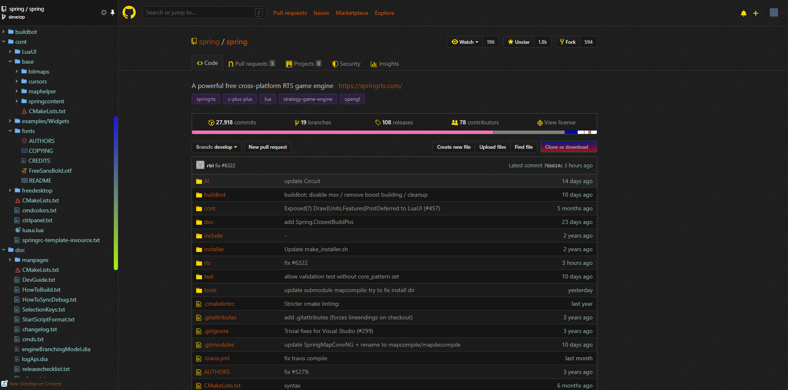

  <!--  -->
  

# StylishTheme

Mainly store some personal StylishThemes

ST001 Colorful Github Dark

## Colorful Github Dark

### Preview

### Involving Style

图标、按钮、头像、选项卡、滚动条、搜索、单选、复选、下拉列表、Octotree插件等尽可能统一样式风格...

### Installation

基于以下主题整合扩展，实现一体化安装

[[vip-darkhub-code-purple](https://userstyles.org/styles/172338/vip-darkhub-code-purple)] [[octotree-for-github-ice-dark](https://userstyles.org/styles/170999/octotree-for-github-ice-dark)]

### Cooperate

搭配代码树插件 [[Octotree]](https://chrome.google.com/webstore/detail/octotree/bkhaagjahfmjljalopjnoealnfndnagc?utm_source=chrome-ntp-icon)

### Apply Site
[[Github.com]](https://github.com)

