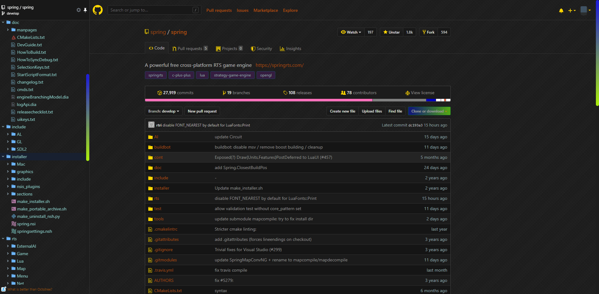

  

# **StylishTheme**
> **Mainly store some personal StylishThemes**

# **Theme Lists**

    ST001 Colorful Github Dark

# [**Colorful Github Dark**](https://userstyles.org/styles/176334/colorful-github-dark)
## **Preview**

## **Involving Style**
> **As uniform as possible style**

- **Tab**
- **Icon**
- **Avatar**
- **Button**
- **Search**
- **ScrollBar**
- **Octotree Plugin**
- **Drop-Down List**
- **Radio、Checkbox**
- **...**

## **Integrated Build**
> **Integrated deployment based on the following topics for integrated installation**

- [vip-darkhub-code-purple](https://userstyles.org/styles/172338/vip-darkhub-code-purple)
- [octotree-for-github-ice-dark](https://userstyles.org/styles/170999/octotree-for-github-ice-dark)

## **Cooperate**
> **Cooperate code tree plugin**

- [Octotree](https://chrome.google.com/webstore/detail/octotree/bkhaagjahfmjljalopjnoealnfndnagc?utm_source=chrome-ntp-icon)

## **Apply Site**
- [Github.com](https://github.com)

## **Change Log**
- `V1.0` init theme
- `V1.01` 将图片亮度降低、统一explore、marketplace页面样式、其他小更新

    More,Please wait ...

